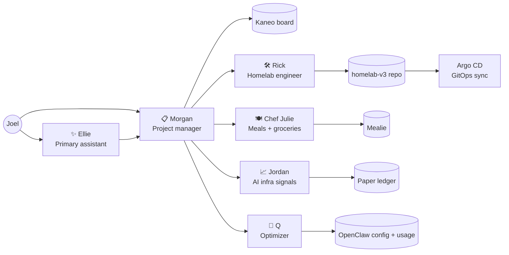
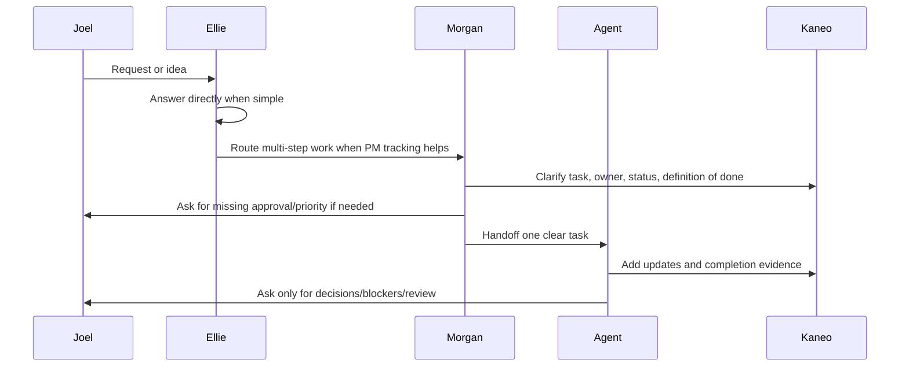
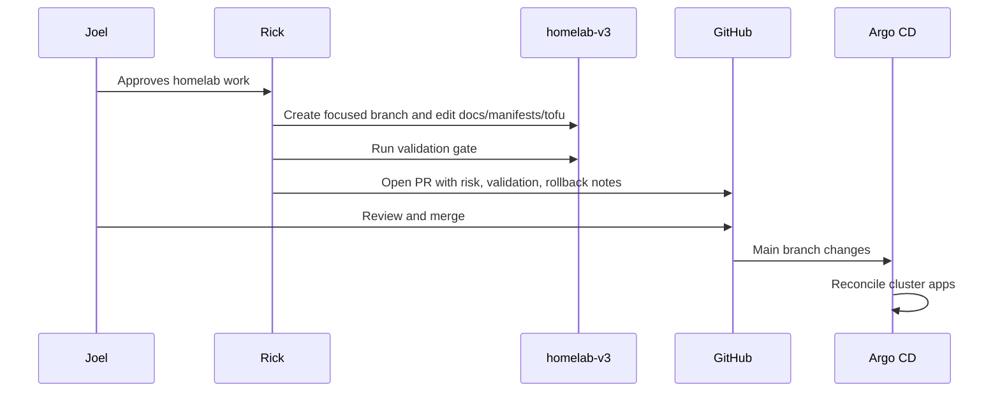

# OpenClaw agent overview

> Last refreshed: 2026-05-05

Joel's homelab now has a small OpenClaw agent swarm around it: one primary assistant, a homelab engineer, a PM coordinator, a meal-planning agent, a market-research/paper-trading agent, and an optimizer. This page is the public-friendly map of who exists, what each agent owns, and how the big workflows move.

## Agent map

## Roster

| Agent | Role | Primary surfaces | Cadence | Page |
| --- | --- | --- | --- | --- |
| ✨ Ellie | Primary personal assistant and default Telegram interface. | Telegram direct chat, OpenClaw workspace memory. | On demand, plus daily tech/news brief. | [Ellie](ellie.md) |
| 🛠️ Rick | Homelab platform/SRE engineer for `joelmccoy/homelab-v3`. | Homelab repo, GitHub PRs, read-only infra diagnostics when needed. | Daily security/cleanup review; on-demand build/review work. | [Rick](rick.md) |
| 📋 Morgan | PM coordinator for Kaneo tasks and agent handoffs. | Kaneo board, Telegram summaries, agent sessions. | Hourly daytime sweep, 9 PM final sweep, weekly capture prompt. | [Morgan](morgan.md) |
| 🍽️ Chef Julie | Vegetarian meal planning, recipe curation, grocery handoff, meal feedback. | Mealie, local meal-planning memory, Telegram approvals. | Weekly meal-planning cadence plus recipe scouting/research. | [Chef Julie](chef-julie.md) |
| 📈 Jordan Belfort | AI-infra bottleneck signal research and paper-trading ledger. | Public/user-provided sources, local paper ledger, Telegram summaries. | Weekday daily market/signal ingestion. | [Jordan](jordan.md) |
| 🧪 Q | OpenClaw optimizer and agent-swarm quartermaster. | OpenClaw status, cron/session metadata, per-agent notes. | Daily optimizer sweep and weekly usage report. | [Q](q.md) |

## Operating principles

- **Joel stays in control.** Agents can inspect and draft freely, but external writes, purchases, messages, repo PRs, and risky infra actions require the right approval boundary.
- **Kaneo is the coordination board.** Morgan keeps tasks clear, owned, and linked before handing work to another agent.
- **GitOps first for the homelab.** Rick changes the repo, opens PRs, and lets Joel merge. Runtime cluster state should converge through Argo CD.
- **Small, focused changes.** Agents should avoid churn, speculative abstractions, and noisy reports.
- **Durable state is documented.** Agent workspace memory and skills live in the private OpenClaw state repo; homelab architecture and operational docs live here.

## High-level workflows

### 1. Intake and routing

### 2. Homelab GitOps change

### 3. PM and agent handoff

Morgan keeps the swarm from turning into parallel chaos:

1. Inspect Kaneo for stale, vague, blocked, or ready-for-review work.
2. Make tasks handoff-ready: goal, owner, priority, next action, and definition of done.
3. Respect the one-active-task-per-bot rule.
4. Send the right agent a concise handoff with the Kaneo deep link.
5. Verify delivery when jobs are scheduled.
6. Close the loop with completion evidence and actual end date.

### 4. Meal planning

Chef Julie follows a weekly loop:

1. Thursday intake for dinners/lunches, schedule constraints, cravings, budget, and use-up ingredients.
2. Friday draft vegetarian plan with a repeatable breakfast and snack.
3. Sunday grocery handoff for the approved plan/list; no checkout or purchase automation.
4. Saturday feedback capture so repeats, skips, and modifications improve future plans.
5. Recipe scouting proposes real linked recipes and asks before Mealie imports.

### 5. AI-infra signal research

Jordan's research loop:

1. Ingest allowed public or user-provided source material.
2. Extract ticker mentions, thesis changes, catalysts, risks, sentiment, confidence, and URLs.
3. Log normalized signals and simulate paper trades only when rules and price data allow.
4. Mark open positions and preserve evidence.
5. Send Joel only meaningful deltas, never live-trade actions.

### 6. Swarm optimization

Q watches for ways to make the whole setup cheaper, quieter, and more reliable:

1. Inspect cron jobs, agent workspaces, session/status signals, and usage metadata.
2. Preserve per-agent notes.
3. Recommend deterministic scripts, narrower tools, compaction, or cadence changes only when evidence supports it.
4. Ask Joel for explicit approval before changing another agent, config, cron, repo, or external service.

## Weekly inventory upkeep

A weekly OpenClaw job keeps this directory fresh. The job should:

1. Inspect current OpenClaw agents, workspaces, and cron jobs.
2. Compare them to this overview and the per-agent pages.
3. Open or prepare a docs update whenever the roster, cadence, responsibilities, or safety boundaries change.
4. Ask Rick to turn the local docs branch into a PR against `joelmccoy/homelab-v3`.

This is intentionally lightweight: the point is to keep the agent map trustworthy without creating documentation theater.
