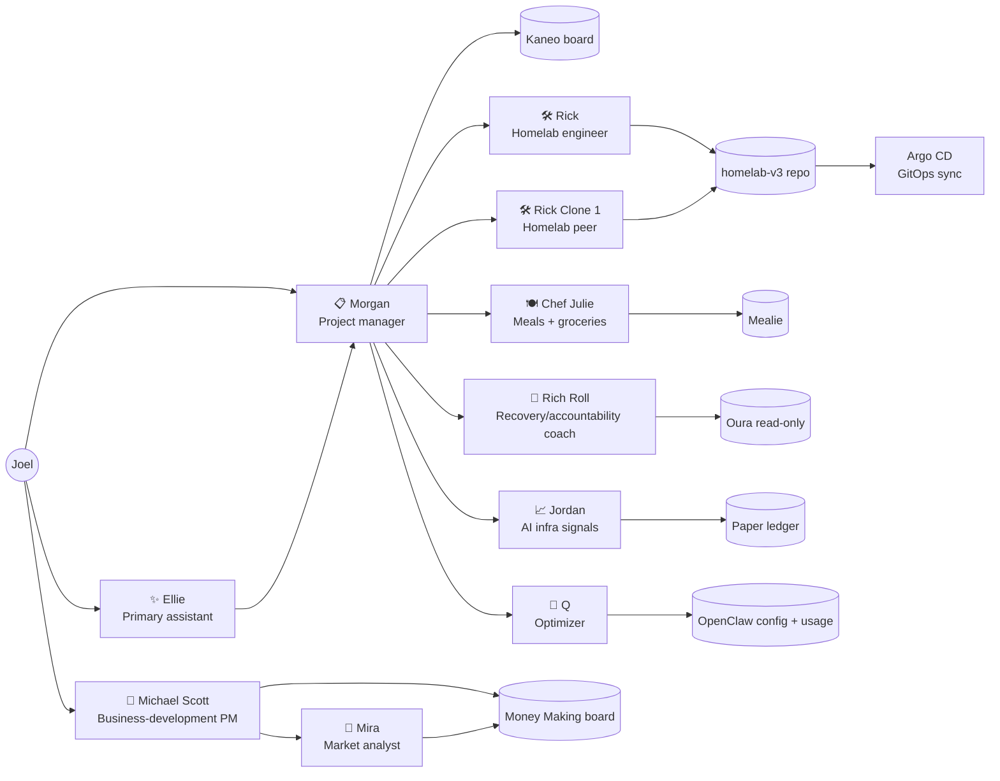
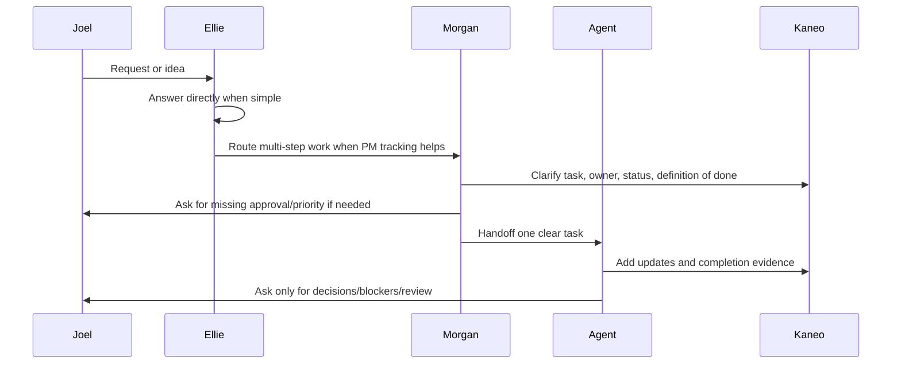
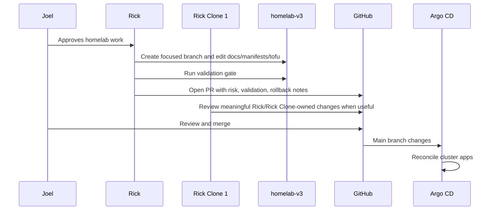

# OpenClaw agent overview

> Last refreshed: 2026-05-18

Joel's OpenClaw setup is a small, approval-gated agent swarm: a primary assistant, project manager, homelab engineers, meal planner, recovery/accountability coach, AI-infra signal researcher, business-development pair, and optimizer. This page is the public-friendly map of who exists, what each agent owns, and how the main workflows move.

## Agent map

## Roster

| Agent | Role | Primary surfaces | Cadence | Page |
| --- | --- | --- | --- | --- |
| ✨ Ellie | Primary personal assistant and default Telegram interface. | Telegram direct chat, OpenClaw workspace memory. | On demand; weekday AI/platform brief; Thursday Austin events shortlist. | [Ellie](ellie.md) |
| 📋 Morgan | PM coordinator for Kaneo tasks and agent handoffs. | Kaneo board, Telegram summaries, agent sessions. | Weekday morning/evening PM sweeps; weekly capture prompt. | [Morgan](morgan.md) |
| 🛠️ Rick | Homelab platform/SRE engineer for `joelmccoy/homelab-v3`. | Homelab repo, GitHub PRs, read-only infra diagnostics when needed. | Daily security/cleanup review; weekly agent-doc inventory; on-demand build/review work. | [Rick](rick.md) |
| 🛠️ Rick Clone 1 | Second narrow homelab/coder agent and peer reviewer. | Homelab repo, GitHub PR review comments, Kaneo handoffs. | Daily homelab peer-review check; on-demand bounded implementation/review. | [Rick Clone 1](rick-clone-1.md) |
| 🍽️ Chef Julie | Vegetarian meal planning, recipe curation, grocery handoff, meal feedback. | Mealie, local meal-planning memory, Telegram approvals. | Weekly intake/plan/grocery/feedback loop; recipe scouting; grocery-provider research. | [Chef Julie](chef-julie.md) |
| 🏃 Rich Roll | Lightweight recovery, activity-pattern observation, and accountability coach. | Oura read-only summaries, local health-coach notes, Telegram check-ins. | Daily morning observation/accountability note and evening check-in. | [Rich Roll](rich-roll.md) |
| 📈 Jordan Belfort | AI-infra bottleneck signal research and paper-trading ledger. | Public/user-provided sources, local paper ledger, Telegram summaries. | Weekday daily market/signal ingestion. | [Jordan](jordan.md) |
| 💼 Michael Scott | Approval-gated business-development PM for passive/semi-passive income experiments. | Kaneo Money Making project, opportunity memos, Telegram approval asks. | Daily sprint-style niche scan, memo builder, and pipeline review during active research windows. | [Michael Scott](michael-scott.md) |
| 🔎 Mira | Market-intelligence analyst for Michael's money-making research. | Public research, competitor/pricing evidence, opportunity scorecards. | On demand / delegated research; workspace exists for specialist market-analysis work. | [Mira](mira.md) |
| 🧪 Q | OpenClaw optimizer and agent-swarm quartermaster. | OpenClaw status, cron/session metadata, per-agent notes. | Weekday optimizer sweep and weekly usage report. | [Q](q.md) |

## Operating principles

- **Joel stays in control.** Agents can inspect and draft freely, but external writes, purchases, messages, repo PRs, public actions, financial actions, and risky infra actions require the right approval boundary.
- **Kaneo is the coordination board.** Morgan keeps homelab/agent tasks clear, owned, and linked; Michael uses a separate Money Making project for revenue research.
- **GitOps first for the homelab.** Rick and Rick Clone 1 change the repo, open PRs, and let Joel merge. Runtime cluster state should converge through Argo CD.
- **Small, focused changes.** Agents should avoid churn, speculative abstractions, noisy reports, and vague handoffs.
- **Durable state is documented privately.** Agent workspace memory and skills live in private OpenClaw state; public homelab architecture and operational docs live here.

## High-level workflows

### 1. Intake and routing

### 2. Homelab GitOps change and peer review

### 3. PM and agent handoff

Morgan keeps the swarm from turning into parallel chaos:

1. Inspect Kaneo for stale, vague, blocked, or ready-for-review work.
2. Make tasks handoff-ready: goal, owner, priority, next action, and definition of done.
3. Respect the one-active-task-per-bot rule.
4. Send the right agent a concise handoff with the Kaneo deep link.
5. Verify delivery when jobs are scheduled.
6. Close the loop with completion evidence and actual end date.

### 4. Meal planning

Chef Julie follows a weekly loop:

1. Thursday intake for dinners/lunches, schedule constraints, cravings, budget, and use-up ingredients.
2. Friday draft vegetarian plan with a repeatable breakfast and snack.
3. Sunday grocery handoff for the approved plan/list; no checkout or purchase automation.
4. Saturday feedback capture so repeats, skips, and modifications improve future plans.
5. Recipe scouting proposes real linked recipes and asks before Mealie imports.
6. Grocery-provider research stays read-only or dry-run unless Joel approves a specific cart/provider test.

### 5. Recovery and activity accountability

Rich Roll keeps the health loop lightweight:

1. Read allowed Oura recovery/activity signals and recent local check-ins.
2. Share a concise morning observation or accountability nudge tied to Joel's stated intent.
3. Ask a tiny evening activity/energy check-in.
4. Use trends and Joel's subjective report; avoid medical diagnosis, workout recommendations, or dramatic reactions to one bad night.
5. Ask before adding integrations, storing raw data long term, or expanding the coaching scope.

### 6. AI-infra signal research

Jordan's research loop:

1. Ingest allowed public or user-provided source material.
2. Extract ticker mentions, thesis changes, catalysts, risks, sentiment, confidence, and URLs.
3. Log normalized signals and simulate paper trades only when rules and price data allow.
4. Mark open positions and preserve evidence.
5. Send Joel only meaningful deltas, never live-trade actions.

### 7. Business-development research

Michael and Mira keep revenue ideas approval-gated:

1. Michael maintains the Money Making board and decides which opportunities need research.
2. Mira investigates customer pain, competitors, pricing, demand signals, and rough economics from public evidence.
3. Michael turns promising lanes into concise opportunity memos and approval asks.
4. No spend, outreach, publishing, account creation, public endpoints, or customer commitments happen without Joel's explicit approval.
5. Ideas are killed quickly when evidence is weak or the lane is not solo-operable enough.

### 8. Swarm optimization

Q watches for ways to make the whole setup cheaper, quieter, and more reliable:

1. Inspect cron jobs, agent workspaces, session/status signals, and usage metadata.
2. Preserve per-agent notes.
3. Recommend deterministic scripts, narrower tools, compaction, or cadence changes only when evidence supports it.
4. Ask Joel for explicit approval before changing another agent, config, cron, repo, or external service.

## Weekly inventory upkeep

A weekly Rick job keeps this directory fresh. The job should:

1. Inspect current OpenClaw agents, workspaces, and cron jobs.
2. Compare them to this overview and the per-agent pages.
3. Open or prepare a docs update whenever the roster, cadence, responsibilities, or safety boundaries change.
4. Use Rick's repo-scoped GitHub App helper for bot commits and PRs.

This is intentionally lightweight: the point is to keep the agent map trustworthy without creating documentation theater.
